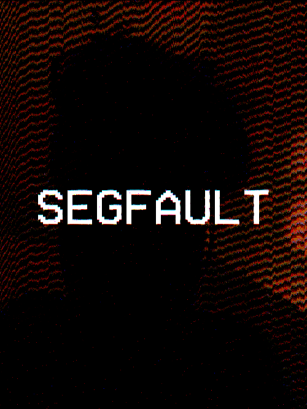
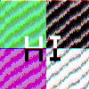
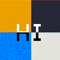
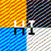
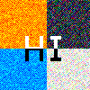
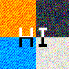

# OptoGlitch

Turning an Arduino, a LED and a Photo Resistor into an physical glitch art filter!

## Showcase



## Prelude

It is absolutely no secret that I have an unhealthy obsession with the aesthetics manifested by analogous errors. Despite the fact that the VHS Cassette was already being replaced by its digital competitor, the DVD, by the time I was born, I was still fortunate enough to become one of the last witnesses of the legendary video format. The time stamps, the "play" button, the washed out colors and static noise will always invoke a warm feeling of nostalgia for me. And it is due to this induced nostalgia, that my desire in glitch art strives after the analogous error.

Since the introduction of digital media formats, we have become spoiled in media quality. As an result, we now treat analogous error as an visual aesthetic, and ironically often attempt to digital recreate it. I myself must obviously admit, that I proudly contribute to the digital recreation of analogous error, in form of glitch art. While I have yet to get my hands on a proper VHS recorder or camcorder, I have attempted to improvise by finding alternate ways of analogous data transfer that do not require access to the rather complex electronics found in a VHS recorder. And that is exactly what has lead to this project. While the results certainly vary from VHS glitches, I must admit that I am still very satisfied by the errors caused through analogous noise.

## Overview

OptoGlitch is an Arduino project that attempts to artificially induce analogous errors by passing image data through an analogous optocoupler circuit. The optocoupler consists nothing more than a photo resistor, a LED (blue in our case) and an additional resistor that acts as a voltage reference for the photo resistor input. The optocoupler is intentionally left exposed to capture as much environmental noise as possible. As a result, the output values can be bended by the simple utilization of an external light source such as a flash light.

The transmission of data is achieved by setting the LED to the brightness of the pixel value (ex. (255, 0, 120) would set the LED to 255 brightness, 0 brightness and 120 brightness). The photo resistor captures the brightness of the LED, and the software attempts match the photo resistor input to its original pixel value. Since the process is analogous, it is very prone to noise caused by external light sources. Additionally, the Arduino can only distinguish between a finite set of voltage levels. These, and many more factors result in errornous readings, which are then responsible for the glitch aesthetics.

Since the photo resistor readings don't exactly match the LED brightness, the software attempts to calibrate the photo resistor input through the computation of a standard deviation. Before any image is parsed, the Arduino performs a calibration process, in which is the photo resistor input is compared to all 256 LED brightness levels (0 - 255). From the received set of photo resistor inputs (256 inputs in total), the Arduino then computes the standard deviation. In the upcoming future, it is also planned to implement calibration through the use of an lookup table.   

The intensity of error can be further reduced through the implementation of a mean reading. A mean reading is determined by calculating the average of a set of photo resistor inputs for a specific brightness, rather than just relying on a single sample. The amount of samples to calculate the mean can be specified through the serial console via the `set samples` command. For instance, `set samples 0` will skip the calculation of a mean and simply rely on a single reading. Contrary, `set samples 100` will tell the Arduino to collect a total of 100 samples per brightness and then calculate the mean. By default, the `samples` property is set to 0.

Original:


---

`set samples 0`:



Parse time: 00:30 Seconds

---

`set samples 50`:



Parse time: 03:26 min

---

`set samples 100`:


Parse time: 06:03 min

With sample rate, color accuracy and parse time rises.

Further, we tend to reach the end of an threshold, as change in the mean reduces with more values provided.

Another property that can greatly reduce error is the `transition` property. Just like the mean sample rate, the transition property can be set through the serial console via the `set transition` command. The transition property defines the given time in ms for the LED to change its brightness. Giving the LED more time to change its brightness reduces the risk of developing artifacts from the previous pixel value. By default the transition time is set to 0, as such an error often provides desired aesthetics.

Original:


---

`set transition 0`


Parse time: 00:30 Seconds

---

`set transition 1`



Parse time: 01:00 min

---

`set transition 5`



Parse time: 03:00 min

---

`set transition 10`



Parse time: 05:31 min

Once again, the accuracy and time rises. Obviously an LED only a fixed ammount of time to fully change its brightness. As a result, it is isn't recommended to set this property to values above 10ms, as no notable improvements should be visible.

Utilizing both properties will clearly yield the best results, if those are desired:

Original:


---

`set samples 100` and `set transition 5`:


Parse time: 08:34 min

## Documentation

A hardware and software documentation is planned

## License

This project is licensed by the GPLv3

```
Copyright (C) 2018 Patrick Pedersen <ctx.xda@gmail.com>

This program is free software: you can redistribute it and/or modify
it under the terms of the GNU General Public License as published by
the Free Software Foundation, either version 3 of the License, or
(at your option) any later version.

This program is distributed in the hope that it will be useful,
but WITHOUT ANY WARRANTY; without even the implied warranty of
MERCHANTABILITY or FITNESS FOR A PARTICULAR PURPOSE.  See the
GNU General Public License for more details.

You should have received a copy of the GNU General Public License
along with this program.  If not, see <https://www.gnu.org/licenses/>.
```
